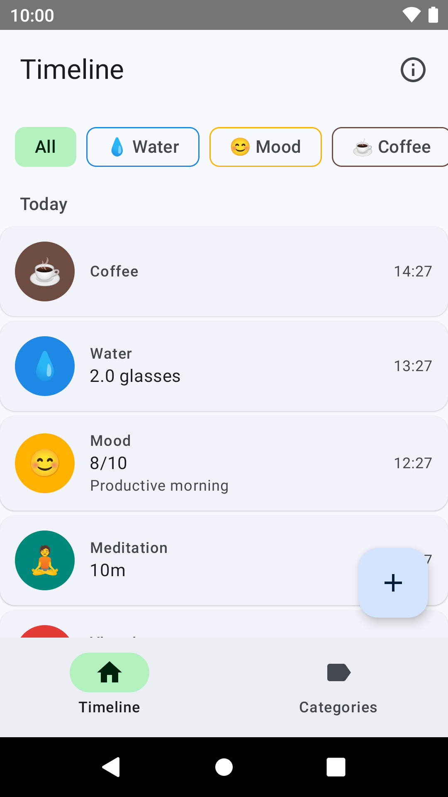
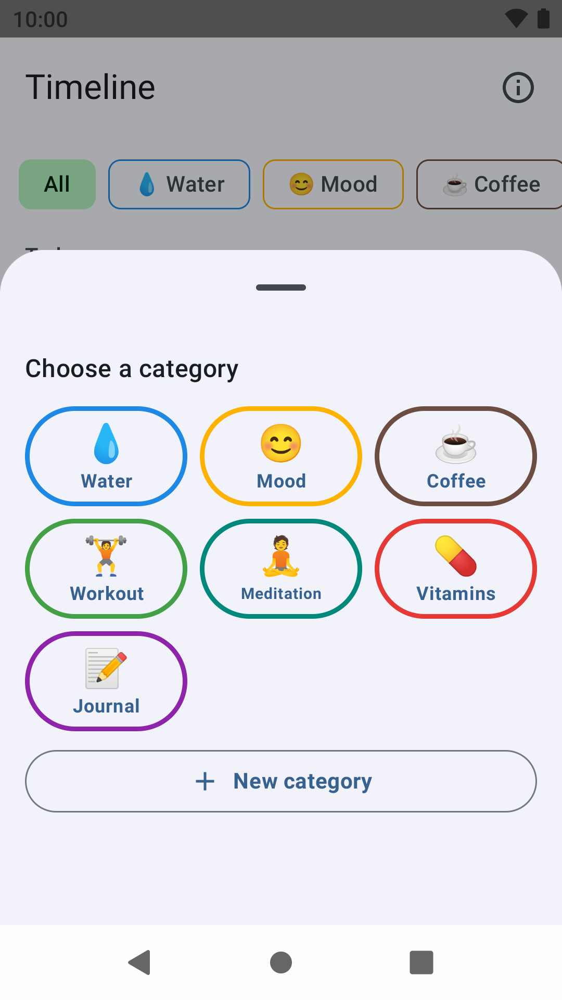
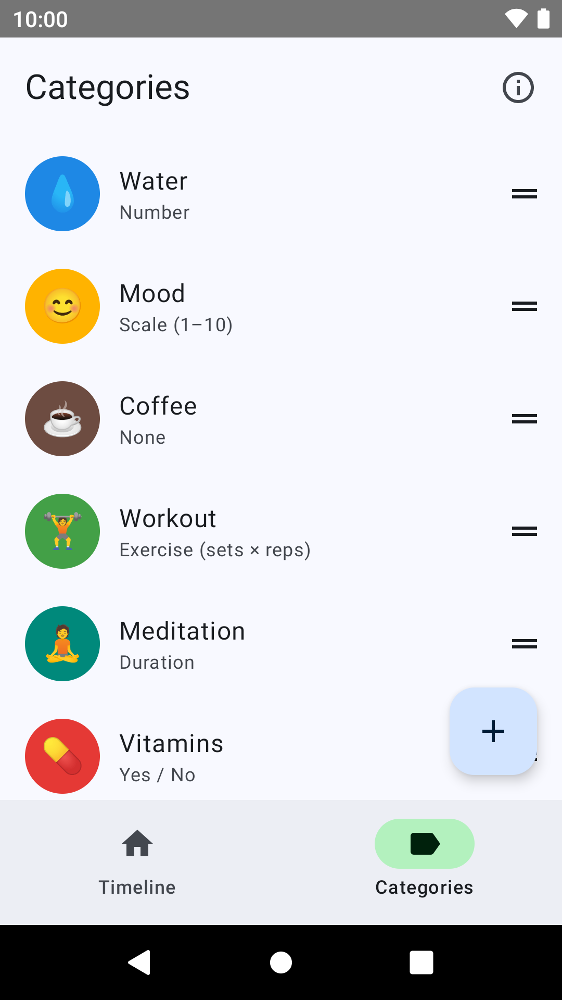

# Trackr

<p align="center">
  
</p>

Trackr is a local-first Android app for logging whatever you want to keep track of — habits, mood, water, workouts, medications, practice sessions, the plants you watered. Define your own categories, each with its own emoji, color, and value type, then capture an entry in as few as three taps. No account required, and your data stays on your device.

<p align="center">
  
  
  
</p>

<p align="center"><em>Your timeline · the three-tap quick-log picker · fully customizable categories</em></p>

## Alpha testers wanted

Trackr is in **[closed testing on Google Play](https://play.google.com/store/apps/details?id=net.clahey.trackr)**, working toward a 1.0 release. Want early access and a say in where it goes? **Get in touch** — email `youraveragechris@gmail.com` with the Google account you'd test with, and I'll add you to the closed test.

## Features

- **User-defined categories** — give each one a name, emoji, color, and value type
- **Seven value types**: occurrence only, scale (1–10), yes/no, number with unit, free text, duration (H:M:S), exercise (sets × reps)
- **Quick-log** — FAB → category → save in three taps; filtered view skips the category picker
- **Timeline** — events grouped by day, most recent first; swipe to delete with undo
- **Event edit** — full edit of timestamp, value, notes, and attached photos
- **Category filter** — tap a chip to filter the timeline to one category
- **Photo attachments** — camera or gallery; quick-log captures one image, edit screen allows multiple
- **Fully offline** — all data lives in a Room (SQLite) database on your device

## Requirements

- Android 8.0 (API 26) or higher

## Tech Stack

- **Kotlin** + **Jetpack Compose** (Material 3)
- **Room** for local persistence
- **Hilt** for dependency injection
- **kotlinx.serialization** for the flexible JSON value model
- **Material You** dynamic color on Android 12+; tonal palette fallback on older devices

## Building

Clone the repo and open it in Android Studio, or build from the command line:

```bash
./gradlew assembleDebug
```

Install on a connected device or emulator:

```bash
./gradlew installDebug
```

## Architecture

```
Compose UI → ViewModels → TrackrRepository (interface) → LocalTrackrRepository → Room
```

The repository interface is the sole seam between the UI and persistence, keeping ViewModels independent of Room and making a future cloud backend a drop-in addition. Event values are stored as JSON strings and decoded into a typed `EventValue` sealed class via Room TypeConverters, so new value types can be added without schema migrations.

## License

GPLv2 — see [LICENSE](LICENSE).
