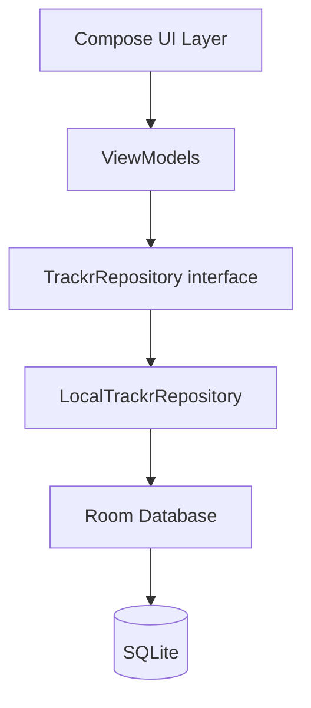

# High-Level Design: Trackr

## Problem

People tracking recurring health and lifestyle patterns (pain levels, food intake, medications, exercise, mood) have no lightweight tool that lets them define arbitrary event categories and log entries quickly. Existing apps are either too narrow (single-category trackers) or too heavy (full health platforms requiring accounts and structured schemas).

## Approach

A local-first Android app where users define their own event categories (each with a name, emoji, color, and value type) and log timestamped entries against them. All data lives on-device in a Room database. The data layer is abstracted behind a repository interface so a cloud sync or GraphQL backend can be added later without touching the UI.

## Target Users

Individuals tracking personal health and lifestyle data who want:
- Full control over what they track and how
- No account or cloud requirement
- Fast, frictionless daily logging

## Goals

- Log any event in under three taps
- Support at least seven value types: none (occurrence), scale 1–10, boolean, numeric with unit, free text, duration, exercise (sets × reps)
- User-defined categories with emoji, color, and value type
- Two-level category hierarchy (parent → subcategory); subcategories inherit color, emoji, and value type from their parent but can override any field individually
- Category edit screen displays a live preview of how a timeline row will look with the current name, emoji, color, and value type
- Category color used throughout the UI wherever categories are identified: timeline row avatars, filter chips, category list rows, quick-log category grid, and category edit screen
- Attach photos to an event (camera or gallery); quick-log captures one image, full edit allows multiple
- Timeline view of events grouped by day
- Data stays fully on-device; no network required

## Non-Goals

- Cloud sync or multi-device in v1 (near-term: Android Auto Backup as a baseline; full sync is post-v1)
- Charts, trends, or analytics in v1
- Cross-user sharing in v1 (intended post-v1 feature; shapes the backend direction below)
- iOS support (Android-only)
- Social or community features in v1

## System Design

**Major components:**

- **UI Layer** — Jetpack Compose screens: Home (timeline), Add Event (bottom sheet), Categories (management), Event detail/edit. A bottom navigation bar with two tabs (Timeline, Categories) provides top-level navigation; hidden on detail screens.
- **ViewModels** — state holders per screen; expose `StateFlow`; consume repository
- **Repository interface** — `TrackrRepository` — sole seam for future backend swap
- **LocalTrackrRepository** — Room-backed implementation
- **Room Database** — two tables: `categories`, `events`. `Category` supports a two-level hierarchy via `parentId: String?` (null = top-level). Subcategories store null for any field they inherit from their parent (color, emoji, valueType); top-level categories always carry explicit values. The UI layer resolves effective values by falling back to the parent when a field is null.
- **Image storage** — image files written to app-private storage (`context.filesDir`); paths stored as a JSON list in the `events` table; never stored as blobs
- **App Shell** — `TrackrApplication` (`@HiltAndroidApp`), `MainActivity` (`@AndroidEntryPoint`), Hilt modules, and the Compose `NavHost`. ViewModel arguments pass via `SavedStateHandle` (compatible with process-death restoration). The app's permanent Play Store identity is `applicationId = "net.clahey.trackr"`; this value is immutable once published.

## Key Design Decisions

**Repository interface as the only seam.** All ViewModel code depends on `TrackrRepository`, not on Room directly. When a GraphQL backend is added, only a new implementation is needed — no ViewModel changes.

*Alternatives considered:* direct Room DAO injection into ViewModels (faster to write, impossible to swap); UseCase layer (extra indirection not justified at this scale).

**Flexible value model: JSON storage + kotlinx.serialization TypeConverters.** Each category declares a `ValueType`; the stored value is JSON `String?` (null for `NONE`). A Room `TypeConverter` using kotlinx.serialization converts between the raw string and a typed `EventValue` sealed class. ViewModels and UI always work with the typed sealed class — never raw strings. This avoids a polymorphic table schema while keeping the entire stack above Room fully type-safe.

*Alternatives considered:* raw string interpreted at UI layer (leaks storage concerns into UI); separate tables per value type (over-normalized for this scale).

**Material You theming with brand-color fallback.** On Android 12+ the app uses dynamic color (adapts to the user's wallpaper). On older devices it falls back to a Material 3 tonal palette seeded from the brand color `0xFF37618E`. Dark mode is supported from the start via the standard `isSystemInDarkTheme()` switch. Default Material 3 typography and shapes throughout.

*Alternatives considered:* fixed palette only (ignores user's system preference); fully custom theme (unjustified work at this scale).

**Hilt for DI.** Standard Android DI; keeps ViewModels testable and repository injection straightforward.

**Localizable strings via Android resource system.** All user-visible text is defined in `res/values/strings.xml` (and future `res/values-XX/strings.xml` locale overrides) rather than hardcoded in Kotlin. Plurals use `<plurals>` resources and `pluralStringResource()`. The app follows the system locale; no in-app language picker is provided.

*Alternatives considered:* hardcoded strings (fast but unlocalizeable); third-party i18n libraries (unnecessary when the Android resource system covers the need).

**Two-level category hierarchy.** Categories support one level of nesting (parent → subcategory). A category with children cannot be re-parented; a category with a parent cannot receive children. This covers the grouping and subtype use case without recursive query complexity or deep-tree UI problems.

*Alternatives considered:* full tree (arbitrary depth) — adds recursive Room queries and unwieldy navigation UI; flat groups (separate entity, not loggable) — prevents logging at the group level, which allows the UX to be flexible to user needs.

**Subcategory inheritance via nullable fields.** Subcategories store `null` for color, emoji, and valueType to mean "inherit from parent." Top-level categories always carry explicit values. Effective values are resolved by the UI layer, not the repository, so all stored events reference the raw category without denormalization.

*Alternatives considered:* denormalize at write time (copy parent values) — breaks when the parent is later edited; separate override-flag columns — extra schema complexity without observability benefit over nullable fields.

**Image capture via FileProvider, no `CAMERA` permission.** Photos are captured by delegating to the system camera app via `FileProvider`; the app writes a target file to `filesDir/images` and exposes it via a `FileProvider` URI. Multiple images per event are supported on the full edit screen; the quick-log sheet captures at most one. Image paths are stored as a JSON array in the events table. File lifecycle (creation, deletion, orphan recovery) is the repository's responsibility, not the UI's.

*Alternatives considered:* in-app CameraX — richer UX but requires `CAMERA` permission and significant additional code; image BLOBs in SQLite — impractically large rows; external storage — broken by scoped storage restrictions on API 29+.

**Orphan recovery at startup.** Because DB row deletion and image file deletion are separate operations, a process kill between them can leave orphaned files. `onStartup()` scans `filesDir/images` and deletes any file not referenced by a current event row in the database, recovering storage without data loss. Stale category references (events whose category was deleted mid-session) surface gracefully as orphaned events with a missing header rather than crashing.

*Alternatives considered:* strict transactional cleanup across DB + filesystem (impossible without two-phase commit); ignore orphans (accumulates wasted device storage).

## Future Backend Strategy

The `TrackrRepository` interface is the sole seam for a future backend swap — ViewModels and UI are insulated from the storage layer.

### Near term: Android Auto Backup

Enable Android's built-in Auto Backup (configured in `AndroidManifest.xml`). The system backs up the Room database and `filesDir/images` to the user's Google account automatically, with no additional server infrastructure. Restores on reinstall or new device. This is the v1 data-safety baseline — low effort, zero operational burden.

### Post-v1: AppSync + DynamoDB + Lambda (AWS)

The intended full-sync and sharing backend. Chosen because the team is already in the AWS ecosystem.

- **AppSync** — managed GraphQL endpoint; matches the `TrackrRepository` interface's future GraphQL-backed implementation
- **Lambda resolvers** — server-side business logic layer; owns security and sharing rules (clients never have direct DB access)
- **DynamoDB** — primary data store; single-table design with GSIs for sharing access patterns (e.g., "user A shared category X with user B")
- **S3** — image storage; Lambda resolvers generate pre-signed URLs for upload/download
- **Cognito** — user auth and identity

**Implementation approach:** `LocalTrackrRepository` (Room) remains the offline-first local cache; a new `RemoteTrackrRepository` or sync layer talks to AppSync. Background sync keeps the two in agreement. Conflict resolution: last-write-wins on `updatedAt` timestamp (revisit if collaborative editing is needed).

**Sharing model:** sharing relationships are stored in DynamoDB; Lambda resolvers enforce read/write access per relationship. Enables a future web frontend against the same AppSync endpoint.

**Alternatives considered:** Firebase (Firestore + Cloud Functions) — managed but higher Google lock-in and Firestore's document model is less natural for the relational sharing graph. Supabase (Postgres + Edge Functions) — better relational fit, open source, but unfamiliar AWS tooling is not available. Custom server — maximum control but adds hosting and operational burden.

## Success Metrics

- Cold launch to log-entry in ≤ 3 taps
- No data loss on process kill (Room transactions)
- Build compiles and installs on a physical or emulated Android 8+ device

## References

- [Room persistence library](https://developer.android.com/training/data-storage/room)
- [Jetpack Compose](https://developer.android.com/jetpack/compose)
- [Hilt dependency injection](https://developer.android.com/training/dependency-injection/hilt-android)
- `docs/llds/publishing.md` — path to Play Store publishing, store-listing creative (icon, feature graphic, slogan), and compliance forms. No EARS specs or tests apply to this segment — it's process and external assets, not app behavior.
