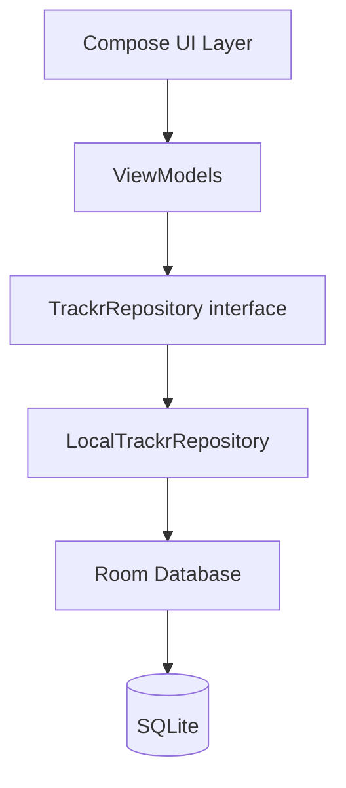

# High-Level Design: Trackr

## Problem

People tracking recurring health and lifestyle patterns (pain levels, food intake, medications, exercise, mood) have no lightweight tool that lets them define arbitrary event categories and log entries quickly. Existing apps are either too narrow (single-category trackers) or too heavy (full health platforms requiring accounts and structured schemas).

## Approach

A local-first Android app where users define their own event categories (each with a name, emoji, color, and value type) and log timestamped entries against them. All data lives on-device in a Room database. The data layer is abstracted behind a repository interface so a cloud sync or GraphQL backend can be added later without touching the UI.

## Target Users

Individuals tracking personal health and lifestyle data who want:
- Full control over what they track and how
- No account or cloud requirement
- Fast, frictionless daily logging

## Goals

- Log any event in under three taps
- Support at least six value types: none (occurrence), scale 1–10, boolean, numeric with unit, free text, duration
- User-defined categories with emoji, color, and value type
- Attach photos to an event (camera or gallery); quick-log captures one image, full edit allows multiple
- Timeline view of events grouped by day
- Data stays fully on-device; no network required

## Non-Goals

- Cloud sync or multi-device in v1 (architecture is open to it; not implementing it)
- Charts, trends, or analytics in v1
- Sharing or exporting in v1
- iOS support (Android-only)
- Social or community features

## System Design

**Major components:**

- **UI Layer** — Jetpack Compose screens: Home (timeline), Add Event (bottom sheet), Categories (management), Event detail/edit. A bottom navigation bar with two tabs (Timeline, Categories) provides top-level navigation; hidden on detail screens.
- **ViewModels** — state holders per screen; expose `StateFlow`; consume repository
- **Repository interface** — `TrackrRepository` — sole seam for future backend swap
- **LocalTrackrRepository** — Room-backed implementation
- **Room Database** — two tables: `categories`, `events`
- **Image storage** — image files written to app-private storage (`context.filesDir`); paths stored as a JSON list in the `events` table; never stored as blobs
- **App Shell** — `TrackrApplication` (`@HiltAndroidApp`), `MainActivity` (`@AndroidEntryPoint`), Hilt modules, and the Compose `NavHost`. ViewModel arguments pass via `SavedStateHandle` (compatible with process-death restoration).

## Key Design Decisions

**Repository interface as the only seam.** All ViewModel code depends on `TrackrRepository`, not on Room directly. When a GraphQL backend is added, only a new implementation is needed — no ViewModel changes.

*Alternatives considered:* direct Room DAO injection into ViewModels (faster to write, impossible to swap); UseCase layer (extra indirection not justified at this scale).

**Flexible value model: JSON storage + kotlinx.serialization TypeConverters.** Each category declares a `ValueType`; the stored value is JSON `String?` (null for `NONE`). A Room `TypeConverter` using kotlinx.serialization converts between the raw string and a typed `EventValue` sealed class. ViewModels and UI always work with the typed sealed class — never raw strings. This avoids a polymorphic table schema while keeping the entire stack above Room fully type-safe.

*Alternatives considered:* raw string interpreted at UI layer (leaks storage concerns into UI); separate tables per value type (over-normalized for this scale).

**Material You theming with brand-color fallback.** On Android 12+ the app uses dynamic color (adapts to the user's wallpaper). On older devices it falls back to a Material 3 tonal palette seeded from the brand color (TBD — tracked as a to-do). Dark mode is supported from the start via the standard `isSystemInDarkTheme()` switch. Default Material 3 typography and shapes throughout.

*Alternatives considered:* fixed palette only (ignores user's system preference); fully custom theme (unjustified work at this scale).

**Hilt for DI.** Standard Android DI; keeps ViewModels testable and repository injection straightforward.

## Success Metrics

- Cold launch to log-entry in ≤ 3 taps
- No data loss on process kill (Room transactions)
- Build compiles and installs on a physical or emulated Android 8+ device

## References

- [Room persistence library](https://developer.android.com/training/data-storage/room)
- [Jetpack Compose](https://developer.android.com/jetpack/compose)
- [Hilt dependency injection](https://developer.android.com/training/dependency-injection/hilt-android)
